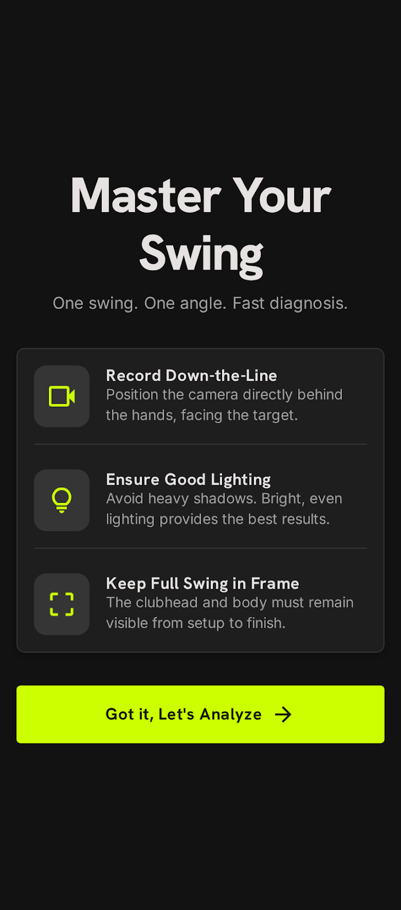
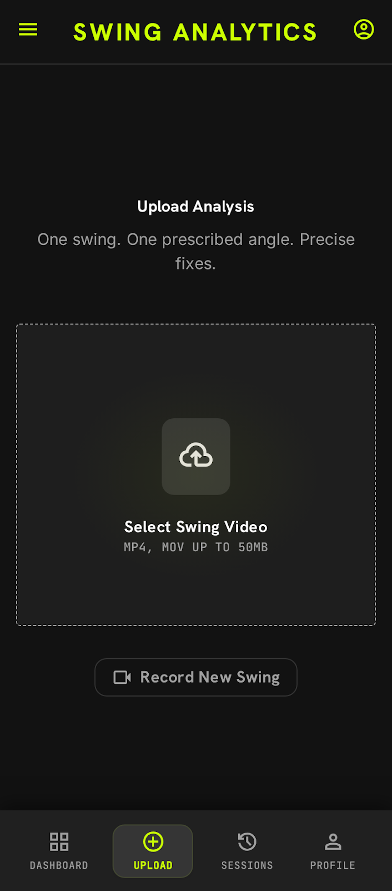
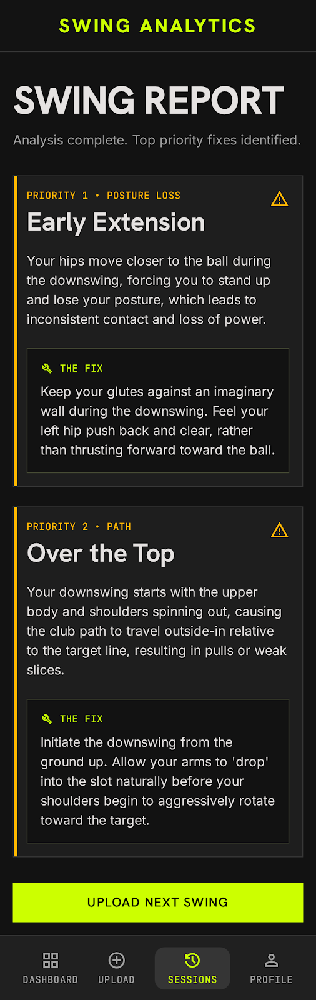
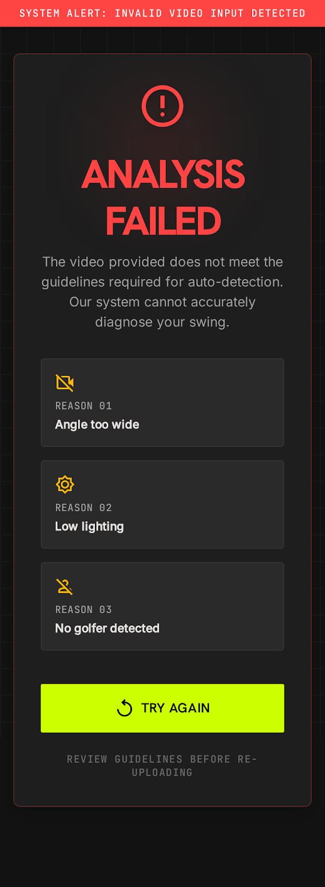

# 🎨 Design Direction — Swing Analyzer v1

This folder is the visual source of truth for the v1 experience. It exists so any
later phase — and Copilot — can reference the intended screens, flow, and design
system instead of guessing.

It maps directly to the [PRD](../prd.md): one swing → top 2–3 flaws → one fix tip
per flaw.

## Core value proposition

A fast, **one-shot feedback loop** for intermediate golfers:

> **1 swing → top 2–3 flaws → 1 fix tip per flaw.**

No accounts, no history, no Q&A. Upload → feedback → done.

## Design direction

- **Aesthetic:** High-performance "Sport Tech." Dark mode first, high-contrast
  electric-green (`#CCFF00`) accents, crisp typography, generous whitespace so the
  focus stays on the data.
- **Tone:** Direct, expert, encouraging. No fluff — just the fix.
- **Mobile-first:** Single-hand use; primary CTAs sit in the bottom "thumb zone."

Full tokens (color, type, spacing, elevation, components) live in
[`design-system.md`](./design-system.md) — codenamed **"Apex Mechanics."**

## User journey

The flow is linear and one-shot. Each step has one job.

| # | Screen | Job | Mockup |
|---|--------|-----|--------|
| 1 | **Welcome / Guidelines** | State the "one swing, one angle" rule up front and set up a high-quality capture (down-the-line, good lighting, full swing in frame). | [`screens/01-welcome-guidelines.png`](./screens/01-welcome-guidelines.png) |
| 2 | **Swing Upload** | A clean, focused surface to select or record one video, with a linear progress indicator during analysis. | [`screens/02-swing-upload.png`](./screens/02-swing-upload.png) |
| 3 | **Analysis Results** | Text-heavy (per PRD) but visually prioritized report: top 2–3 flaws, each with one actionable fix. Priority status bars on the left for fast scanning. | [`screens/03-analysis-results.png`](./screens/03-analysis-results.png) |
| 4 | **Error / Rejection** | Gracefully handle "Bad Input" (wrong angle, too dark, no golfer) with specific reasons and a re-upload CTA — never best-effort analyze a bad video. | [`screens/04-error-rejection.png`](./screens/04-error-rejection.png) |

### 1. Welcome / Guidelines

### 2. Swing Upload

### 3. Analysis Results

### 4. Error / Rejection

## How this ties back to the PRD

- **In scope** — 1 swing, 1 prescribed angle, auto-detected flaws, top 2–3 with
  fix tips, text-only, one-shot with no account. Screens 1–3 deliver exactly this.
- **Detection boundary** — Screen 3 shows a *prioritized* list (not exhaustive),
  and the design supports a valid "no major flaws detected" result.
- **Bad input** — Screen 4 rejects with specific reasons and asks for a re-upload,
  per the PRD's "do not best-effort analyze a bad video" rule.
- **Non-goals** — No annotated frames/video editor, no history, no Q&A surfaces.
  The visuals deliberately stay text-first.

## Files

- [`design-system.md`](./design-system.md) — full design tokens + guidance ("Apex Mechanics").
- [`screens/`](./screens/) — exported mockups for each journey step.
- [`04-error-rejection.reference.html`](./04-error-rejection.reference.html) —
  Tailwind reference implementation for the rejection screen (handy starting point
  for build).
